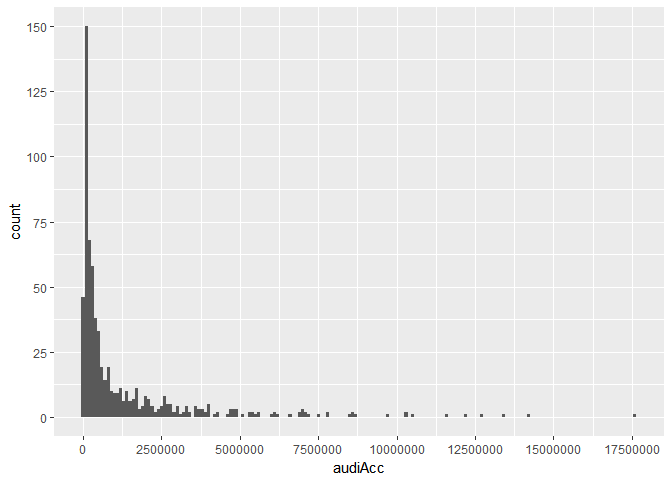
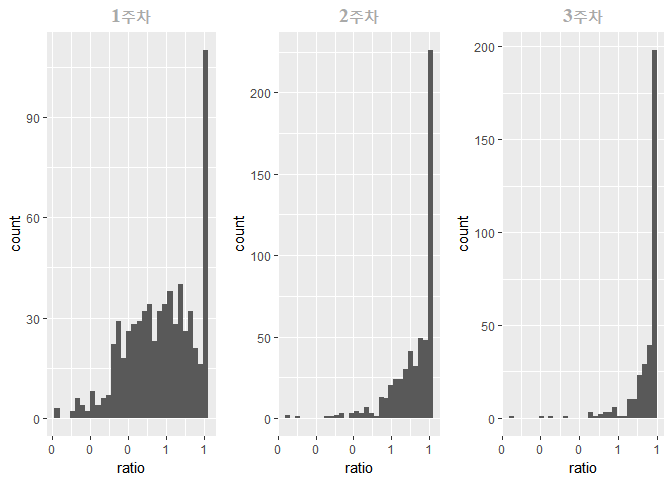

영화관객수 예측 모델링
================
Jo SeungKyu
2018년 4월 24일

Summary
=======

해당 프로젝트는 빅콘테스트에서 \[영화관객수예측\] 공모전에서 진행한것이다. [코비스](http://www.kobis.or.kr/kobisopenapi/homepg/main/main.do)에서 오픈 API를 활용하여 영화정보를 수집하였고, 네이버 영화페이지에서 크롤링을 통해 외부데이터를 수집하였다. API를 통해 가지고 올 수 있는 영화정보는 해당 날짜에 상영하는 영화 중 상위 10개를 수집할 수 있다.(10개 / 1 day) 회귀분석을 통해 모델링을 하였으며 MSE로 모델성능을 평가하였다. 실제 예측할 영화로는 범죄도시, 킹스맨2, 넛잡2 3가지를 선정하였다. 분석은 R로 진행하였으며 사용한 패키지는 다음과 같다.

R Markdown은 렌더링할때 Code를 처음부터 실행한다. 따라서 분석할때 완성한 최종 RData를 불러와 활용하고 해당 보고서에 있는 코드 중 Open API, Crawling, for문 작업은 eval=FALSE로 처리하여 진행하도록 한다.

``` r
load(file = "movie_v1.0.RData")
```

Data Collection
===============

Open API
--------

영화정보 데이터를 수집하기위해 오픈API를 활용하였다. 회원가입 후 Key를 발급받으면 하루에 3000회씩 데이터를 수집할 수 있다. 키는 1인당 2개씩 발급 가능하다. 요청방식은 URL에 해당 \[Key\]와 \[날짜\]를 입력하면 된다. 2014년 1월1일부터 2017년 12월31일까지 약 4년간의 영화정보를 수집할것이다.(해당 분석을 수행한 날짜는 2017.09.15 이었다.) 우선, 4년간의 날짜를 생성하였다. URL에 입력되어야할 날짜는 20140101과 같은 형식으로 되어야하기 때문에 Date타입의 구분자 "-"를 제거하기위해 format함수를 이용하였다.

``` r
startdate <- as.Date("2014-01-01")
enddate <- as.Date("2017-12-31")
date <- seq(startdate, enddate, by="1 days")
date <- format(date, format = "%Y%m%d")
head(date)
```

    ## [1] "20140101" "20140102" "20140103" "20140104" "20140105" "20140106"

발급받은 Key와 사전에 만들어 놓은 날짜를 이용하여 데이터를 요청한다. 요청 형식은 Json이다.

``` r
url <- paste0("http://www.kobis.or.kr/kobisopenapi/webservice/rest/boxoffice/searchDailyBoxOfficeList.json?key=", key, "&targetDt=", 20140101)
tmp <- fromJSON(url)
tmp
```

    ## $boxOfficeResult
    ## $boxOfficeResult$boxofficeType
    ## [1] "일별 박스오피스"
    ## 
    ## $boxOfficeResult$showRange
    ## [1] "20140101~20140101"
    ## 
    ## $boxOfficeResult$dailyBoxOfficeList
    ##    rnum rank rankInten rankOldAndNew  movieCd                   movieNm
    ## 1     1    1         0           OLD 20134803                    변호인
    ## 2     2    2         0           OLD 20124938                    용의자
    ## 3     3    3         0           OLD 20131246               엔더스 게임
    ## 4     4    4         0           OLD 20134046 월터의 상상은 현실이 된다
    ## 5     5    5         1           OLD 20134206           썬더와 마법저택
    ## 6     6    6        -1           OLD 20135428               어바웃 타임
    ## 7     7    7         0           OLD 20135369                    저스틴
    ## 8     8    8         0           OLD 20134267     호빗: 스마우그의 폐허
    ## 9     9    9         0           OLD 20134984    다이노소어 어드벤처 3D
    ## 10   10   10         0           OLD 20134123            집으로 가는 길
    ##        openDt   salesAmt salesShare salesInten salesChange    salesAcc
    ## 1  2013-12-18 5079908000       44.2 1839460000        56.8 46033306000
    ## 2  2013-12-24 2014996000       17.5  686538000        51.7 17644488500
    ## 3  2013-12-31 1237096000       10.8  323271000        35.4  2466384000
    ## 4  2013-12-31  891372500        7.8  247352500        38.4  1634414500
    ## 5  2013-12-24  587466000        5.1  205387000        53.8  3696881000
    ## 6  2013-12-05  495565500        4.3   63600500        14.7 21404538500
    ## 7  2013-12-31  365156000        3.2  146668500        67.1   602885500
    ## 8  2013-12-12  254263500        2.2   65223000        34.5 16818448049
    ## 9  2013-12-19  225230500        2.0   81891500        57.1  4366160500
    ## 10 2013-12-11  150550500        1.3   36723000        32.3 12523890245
    ##    audiCnt audiInten audiChange audiAcc scrnCnt showCnt
    ## 1   671427    206008       44.3 6358474     887    4448
    ## 2   267146     75459       39.4 2443898     588    2419
    ## 3   159750     33963         27  326283     456    2086
    ## 4   118642     24854       26.5  225920     344    1620
    ## 5    83013     23891       40.4  542308     383     846
    ## 6    62901      1660        2.7 2918966     272     776
    ## 7    52069     17927       52.5   88745     332     711
    ## 8    32717      6638       25.5 2148595     169     373
    ## 9    27792      8842       46.7  534956     271     445
    ## 10   19443      3165       19.4 1782674     139     304

data type을 확인하기 위해 2014.01.01 하루에 대해서 출력을 해보았다. 리스트로 반환하는것을 확인 할 수 있고 data.frame형식으로 되어있는 dailyBoxOfficeList를 추출하면 됨을 확인할 수 있다.

이제 4년치의 자료를 수집하도록 한다. 분석에 사용될 변수로는 movieNm, movieCd, opendt, audiCnt, audiAcc, scrnCnt, showCnt, date를 활용할것이다.

``` r
key <- "6d0b3e8f80316cb4830be6dc5ac7bee6"
rawdata <- NULL
for(i in 1:length(date)){
  url <- paste0("http://www.kobis.or.kr/kobisopenapi/webservice/rest/boxoffice/searchDailyBoxOfficeList.json?key=", key, "&targetDt=", date[i])
  tmp <- fromJSON(url)
  rawdata <- rbind(rawdata, tmp$boxOfficeResult$dailyBoxOfficeList)
}
date<-rep(date,each=10) # 날짜를 하루당 10개씩 중복 생성
data<-cbind(rawdata,date)
data <- data[,c("movieNm","movieCd","opendt","audiCnt","audiAcc","scrnCnt","showCnt","date")]
```

다음으로 필요한 데이터는 감독, 배우에 대한 정보이다. 이 또한 Open API를 활용하여 데이터를 수집한다. 앞서 수집했던 rawdata에서 moviecd가 영화의 KEY값이므로 해당변수를 이용한다.

``` r
movieCd<-unique(rawdata$movieCd) #일자별로 영화제목이 중복되어있기 때문에 중복제거
url <- paste0("http://www.kobis.or.kr/kobisopenapi/webservice/rest/movie/searchMovieInfo.json?key="
              ,key,"&movieCd=",movieCd[1])
tmp <- fromJSON(url)
str(tmp)
```

    ## List of 1
    ##  $ movieInfoResult:List of 2
    ##   ..$ movieInfo:List of 17
    ##   .. ..$ movieCd   : chr "20157432"
    ##   .. ..$ movieNm   : chr "007 스펙터"
    ##   .. ..$ movieNmEn : chr "Spectre"
    ##   .. ..$ movieNmOg : chr ""
    ##   .. ..$ showTm    : chr "148"
    ##   .. ..$ prdtYear  : chr "2015"
    ##   .. ..$ openDt    : chr "20151111"
    ##   .. ..$ prdtStatNm: chr "개봉"
    ##   .. ..$ typeNm    : chr "장편"
    ##   .. ..$ nations   :'data.frame':    2 obs. of  1 variable:
    ##   .. .. ..$ nationNm: chr [1:2] "영국" "미국"
    ##   .. ..$ genres    :'data.frame':    4 obs. of  1 variable:
    ##   .. .. ..$ genreNm: chr [1:4] "액션" "어드벤처" "범죄" "스릴러"
    ##   .. ..$ directors :'data.frame':    1 obs. of  2 variables:
    ##   .. .. ..$ peopleNm  : chr "샘 멘데스"
    ##   .. .. ..$ peopleNmEn: chr "Sam Mendes"
    ##   .. ..$ actors    :'data.frame':    4 obs. of  4 variables:
    ##   .. .. ..$ peopleNm  : chr [1:4] "다니엘 크레이그" "레아 세이두" "크리스토프 왈츠" "모니카 벨루치"
    ##   .. .. ..$ peopleNmEn: chr [1:4] "Daniel Craig" "Lea Seydoux" "Christoph Waltz" "Monica Bellucci"
    ##   .. .. ..$ cast      : chr [1:4] "" "" "" ""
    ##   .. .. ..$ castEn    : chr [1:4] "" "" "" ""
    ##   .. ..$ showTypes :'data.frame':    3 obs. of  2 variables:
    ##   .. .. ..$ showTypeGroupNm: chr [1:3] "필름" "2D" "IMAX"
    ##   .. .. ..$ showTypeNm     : chr [1:3] "필름" "디지털" "IMAX"
    ##   .. ..$ companys  :'data.frame':    2 obs. of  4 variables:
    ##   .. .. ..$ companyCd    : chr [1:2] "20100603" "20100603"
    ##   .. .. ..$ companyNm    : chr [1:2] "유니버설픽쳐스인터내셔널 코리아(유)" "유니버설픽쳐스인터내셔널 코리아(유)"
    ##   .. .. ..$ companyNmEn  : chr [1:2] "Universal Pictures International Korea" "Universal Pictures International Korea"
    ##   .. .. ..$ companyPartNm: chr [1:2] "배급사" "수입사"
    ##   .. ..$ audits    :'data.frame':    1 obs. of  2 variables:
    ##   .. .. ..$ auditNo     : chr "2015-MF01220"
    ##   .. .. ..$ watchGradeNm: chr "15세이상관람가"
    ##   .. ..$ staffs    : list()
    ##   ..$ source   : chr "영화진흥위원회"

분석에 사용될 필요한 변수로는 MovieCd, MovieNm, genreNm, directors, PeopleNm, companys 총 6개의 변수가 필요하다고 판단하였다. 배우는 상위 4명만 추출하였다.

``` r
mvdata <- NULL
for(i in 1:length(movieCd)){
  url <- paste0("http://www.kobis.or.kr/kobisopenapi/webservice/rest/movie/searchMovieInfo.json?key="
              ,key,"&movieCd=",movieCd[i])
  tmp <- fromJSON(url)
  mnname <- tmp$movieInfoResult$movieInfo$movieNm
  mvcode <- tmp$movieInfoResult$movieInfo$movieCd
  actor <- tryCatch(tmp$movieInfoResult$movieInfo$actors$peopleNm[c(1,2,3,4)], error=function(e){})
  gen <- tmp$movieInfoResult$movieInfo$genres$genreNm
  nations <- tmp$movieInfoResult$movieInfo$nations$nationNm
  watchGrade <- tmp$movieInfoResult$movieInfo$audits$watchGradeNm
  direct <- tmp$movieInfoResult$movieInfo$directors$peopleNm
  company <- tryCatch(tmp$movieInfoResult$movieInfo$companys
                    [which(tmp$movieInfoResult$movieInfo$companys$companyPartNm == '배급사'),]$companyNm,
                    error=function(e){})
  mvset <- cbind(list(mnname), list(mvcode), list(actor), list(gen), list(direct), list(company), list(nations), list(watchGrade))
  mvdata <- rbind(mvdata,mvset)
  cat("수집완료 -",i,"번째 :",mnname,"\n")
}
mvdata <- as.data.frame(mvdata)
colnames(mvdata) <- c("movieNm","movieCd","actor","genre","direct","company", "nations", "watchGrade")

mvdata[,"movieCd"] <- sapply(mvdata[,"movieCd"], function(x){paste(x, collapse = ",")})
mvdata[,"movieNm"] <- sapply(mvdata[,"movieNm"], function(x){paste(x, collapse = ",")})
mvdata[,"actor"] <- sapply(mvdata[,"actor"], function(x){paste(x, collapse = ",")})
mvdata[,"genre"] <- sapply(mvdata[,"genre"], function(x){paste(x, collapse = ",")})
mvdata[,"direct"] <- sapply(mvdata[,"direct"], function(x){paste(x, collapse = ",")})
mvdata[,"company"] <- sapply(mvdata[,"company"], function(x){paste(x, collapse = ",")})
mvdata[,"nations"] <- sapply(mvdata[,"nations"], function(x){paste(x, collapse = ",")})
mvdata[,"watchGrade"] <- sapply(mvdata[,"watchGrade"], function(x){paste(x, collapse = ",")})
data <- merge(data, mvdata, by = 'movieCd')
data <- rename(data, c(movieNm.x = "movieNm"))
```

Crawling
--------

마지막 데이터 수집으로는 네이버영화 페이지의 개봉 전 \[보고싶어요\] 지수이다. 해당 지수를 얻기위해서는 크롤링을 해야하는데 이를 위해서는 영화코드가 필요하다. 네이버에서 제공하는 영화별 코드와 코비스에서 제공하는 영화코드가 다르기 때문에 재수집을 해야한다. 네이버 영화코드를 수집하는 방법은 2가지이다.

1.  네이버 데이터 랩에서 API를 이용하여 수집.

2.  직접 크롤링을 이용하여 수집.

데이터 랩에서 수집을 하려고 시도 하였으나, 인코딩 문제인지 한글 깨짐 현상이 발생했고 이를 해결하기가 매우 어려웠다. 그래서 두번째 방법으로 직접 코드를 크롤링 하였다.

httr패키지를 이용하면 태그 단위로 해당 chunk를 가지고 올 수 있지만 복잡한 구조의 HTML은 태그를 중복해서 쓰는경우가 많아 오히려 복잡해진다. 따라서 내가 찾고 싶은 위치를 직접 입력하는 방법이 오히려 더 간단하다.(단, Unique하게)

<center>

</center>
크롬의 경우 F12를 누르면 HTML 코드를 확인할 수 있다. 영화코드가 입력되어있는 line은 class="result\_thumb" 부분임을 알 수 있다.

``` r
url1 <- "http://movie.naver.com/movie/search/result.nhn?query="
url2 <- "&section=all&ie=utf8"
movieNm <- unique(data$movieNm)
codes <- NULL
url <- paste(url1,URLencode(iconv("용의자", to="UTF-8")),url2,sep="")
txt <- readLines(url)

tmp <- txt[which(str_detect(txt,"class=\"result_thumb\""))+1] #쌍따옴표 안은 unique하다
code <- str_sub(tmp,str_locate(tmp, "code=")[,2]+1,str_locate(tmp, "\">")[,2]+1,str_length(tmp)-7),
           error=function(e){})
  cat(movieNm[i], ": 완료\n")
  
}

mvcd<-cbind(movieNm,codes)
mvlike <- cbind(mvcd,like)
data <- merge(data,mvlike, by="movieNm")
```

다음으로 해야할것은 장르, 배급사, 국가, 관람등급을 정리하는 과정이다. 두개 이상인 장르, 배급사, 국가, 관람등급에 대해서는 데이터내에서 맨 앞에 있는것을 추출하도록 한다.

``` r
for(i in 1:nrow(data)){

  data$distributor[i] <- str_split(data$company, ",")[[i]][1]
  data$gen[i] <- str_split(data$genre, ",")[[i]][1]
  data$nation[i] <- str_split(data$nations, ",")[[i]][1]
  data$Grade[i] <- str_split(data$watchGrade, ",")[[i]][1]

}
```

Scoring
-------

먼저 수행할 것은 감독,배우에 대하여 스코어를 부여하는 것이다. Score 부여는 여러 논문들을 참고 하여 산출하였으며 산식은 다음과 같다

감독 : 최근 3년동안 동원한 누적 관객관객수

배우 : 주연배우 2명에 대하여 최근 3년동안 동원한 누적 관객관객수의 합

한개의 영화에 대하여 배우는 주연급 배우 2명을 채택하였으며 누적관객수의 합을 구한 이유는 두명의 배우 사이에 시너지 효과가 있을것이라 가정을 전제로 하였다.

``` r
max.acc<-ddply(data,.(movieCd),summarise,audiAcc=max(as.numeric(audiAcc)))
t.data<-merge(max.acc,mvdata,by='movieCd')

tmp<-NULL
for(i in 1:nrow(t.data)){
  tmp_1<-t.data$audiAcc[i]
  tmp_2<-unlist(str_split(t.data$actor[i],","))[c(1,2)]
  tmp_3<-merge(tmp_2,tmp_1)
  tmp<-rbind(tmp,tmp_3)
}
tmp_actor<-ddply(tmp,.(x),summarise,sum_Acc=sum(y)) # 3년동안의 누적관객수 합
actor<-na.omit(tmp_actor) # 애니, 다큐장르의 경우 배우가 존재하지 않아 NA발생
actor$x<-as.character(actor$x)
actor<-filter(actor,x!="")
```

``` r
head(actor)
```

    ##                 x  sum_Acc
    ## 1 다니엘 크레이그  1797440
    ## 2     레아 세이두  2152956
    ## 3   존 크랜신스키   124249
    ## 4 파블로 쉬레이버   124249
    ## 5          김윤석 18399560
    ## 6          하정우 23312265

각각의 배우에 대하여 최근 3년동안의 누적관객수를 구하였다. 이제 기존에 데이터에 추가시키도록 한다.

``` r
for(i in 1:nrow(data)){
    tmp_1<-filter(actor,actor$x==str_split(data$actor,",")[[i]][1])$sum_Acc
    tmp_2<-filter(actor,actor$x==str_split(data$actor,",")[[i]][2])$sum_Acc
    tryCatch(data$actorscore[i]<-tmp_1+tmp_2, error=function(e){}) # 주연 배우 2명의 누적관객수의 합
}
```

감독에 대한 스코어링 또한 마찬가지 방법으로 진행한다.

``` r
tmp<-NULL
for(i in 1:nrow(t.data)){
  tmp_1<-t.data$audiAcc[i]
  tmp_2<-unlist(str_split(t.data$direct[i],","))[c(1,2)]
  tmp_3<-merge(tmp_2,tmp_1)
  tmp<-rbind(tmp,tmp_3)
}

tmp_director<-ddply(tmp,.(x),summarise,sum_Acc=sum(y))
director<-na.omit(tmp_director)
director<-filter(director, x!="")
director$x<-as.character(director$x)

for(i in 1:nrow(data)){
  tmp_1<-filter(director,director$x==str_split(data$direct,",")[[i]][1])$sum_Acc
  tryCatch(data$directorscore[i]<-tmp_1, error=function(e){})
}
```

Data Handling
=============

2절에서는 분석에 필요한 데이터를 모두 수집하였다. 3절에서는 데이터를 가공하는 단계이다. 탐색적 자료분석, 변수변환, 파생변수 생성을 다뤄볼것이다.

Drived Variable
---------------

분석에 앞서 가장 중요한 요일과 공휴일에 대한 변수를 추가하기로 한다. 먼저 요일 변수를 파생한다.

``` r
data<-data[c(order(data$date)),]
rownames(data) <- NULL
data$weekdays <- as.factor(weekdays(as.Date(data$date, format = "%Y%m%d")))
data$date <- as.Date(data$date, format = "%Y%m%d")
```

다음으로 공휴일에 대한 변수를 파생한다. 현재 달력상으로 기입되어있는 공휴일을 아래와 같다.

2014년 : 1.1(수), 1.30(목),1.31(금), 2.1(토), 3.1(토), 5.1(목), 5.5(월), 5.6(화), 6.4(수), 6.6(금), 8.15(금), 9.7(일), 9.8(월), 9.9(화), 9.10(수), 10.3(금), 10.9(목), 12.25(목)

2015년 : 1.1(목), 2.18(수), 2.19(목), 2.20(금), 3.1(토), 5.1(금), 5.5(수), 5.25(월), 6.6(토), 8.15(토), 9.26(토), 9.27(일), 9.28(월), 9.29(화), 10.3(토), 10.9(금), 12.25(금)

2016년 : 1.1(금), 2.7(일), 2.8(월), 2.9(화), 2.10(수), 3.1(화), 4.13(수), 5.5(목), 5.14(토), 6.6(월), 8.15(월), 9.14(수), 9.15(목), 9.16(금), 10.3(월), 10.9(일), 12.25(일)

2017년 : 1.1(일), 1.27(금), 1.28(토), 1.29(일), 1.30(월), 3.1(수), 5.3(수), 5.5(금), 5.9(화), 6.6(화), 8.15(화), 10.2(월), 10.3(화), 10.4(수), 10.5(목), 10.6(금), 10.9(월), 12.25(월)

공휴일이면서 주말인경우는 공휴일이라고 체크하기로 하였다. 또한, 공휴일과 주말을 포함하여 3일을 쉬는날은 황금연휴라고 판단을 하지 않았다. 노동자의 날(5월1일)이 평일인 경우는 공휴일이라 판단을 하였고, 징검다리 연휴의 경우에는 공휴일이라 판단하지 않았다.

따라서, 최종적으로 연휴라고 판단되는 날짜는 아래의 코드와 같다.

``` r
holiday <- as.Date(c("2014-01-01","2014-01-30","2014-01-31","2014-02-01","2014-02-02","2014-03-01","2014-05-01","2014-05-03","2014-05-04","2014-05-05","2014-05-06","2014-06-04","2014-06-06","2014-06-07","2014-06-08","2014-08-15","2014-09-06","2014-09-07","2014-09-08","2014-09-09","2014-09-10","2014-10-03","2014-10-09","2014-12-25",
                     "2015-01-01","2015-02-18","2015-02-19","2015-02-20","2015-02-21","2015-02-22","2015-03-01","2015-05-01","2015-05-02","2015-05-03","2015-05-04","2015-05-05","2015-05-25","2015-06-06","2015-08-15","2015-09-26","2015-09-27","2015-09-28","2015-09-29","2015-10-03","2015-10-09","2015-12-25",
                     "2016-01-01","2016-02-06","2016-02-07","2016-02-08","2016-02-09","2016-02-10","2016-03-01","2016-04-13","2016-05-05","2016-05-06","2016-05-07","2016-05-08","2016-05-14","2016-06-06","2016-08-15","2016-09-14","2016-09-15","2016-09-16","2016-09-17","2016-09-18","2016-10-03","2016-10-09","2016-12-25",
                     "2017-01-01","2017-01-27","2017-01-28","2017-01-29","2017-01-30","2017-03-01","2017-05-01","2017-05-03","2017-05-05","2017-05-06","2017-05-07","2017-05-09","2017-06-06","2017-08-15","2017-09-30","2017-10-01","2017-10-02","2017-10-03","2017-10-04","2017-10-05","2017-10-06","2017-10-07","2017-10-08","2017-10-09","2017-12-25"))


data$holiday<- ifelse(data$date %in% holiday, "Y", "N")
```

공휴일로 지정되어있는 날짜에는 Y을 부여하였다.

다음으로 시사회로 집계되어있는 것들을 제거하였다. 시사회의 경우에는 정식 개봉일이 아니기 때문에 예측에 많은 오차를 줄 수 있다고 판단하였다.

``` r
#### 시사회로 집계된것 제거
data$openDt <- as.Date(data$openDt)
data <- arrange(data, movieNm)
data <- filter(data, ddply(data, .(movieNm), summarise, preview = openDt <= date)$preview==T)
```

2014년 이전에 개봉했으나 영화관에서 상영을 한 경우도 집계됨을 확인 할 수 있다. 때문에 이러한 데이터는 삭제를 해주어야 한다. 2013년 겨울에 개봉한 영화중 2014년에도 상영을 지속하고 있는 영화 또한 제거를 하도록 한다.

``` r
data <- data[which(as.Date(data$openDt) >= as.Date("2014-01-01")),]
```

또한 개봉한 후 상영일수가 7일 미만인 영화는(개봉후 6일까지) 흥행에 실패한 영화로 판단하였고, 이는 분석에 오류를 증가시킬수 있을것이라 생각하였기에 제거하였다.

``` r
tmp <- count(data$movieNm)
tmp <- tmp[which(count(data$movieNm)$freq >= 7),]$x
data <- data[which(data$movieNm %in% tmp == T),] # 개봉후 상영일수 7일 미만 영화 제거
```

다음으로 개봉후 며칠이 경과하였는지의 변수와, 몇주차가 지났는지를 알려주는 변수를 파생하도록 한다.

``` r
#### 개봉 후 며칠이 지났는지 확인하는 변수

data <- data[order(data$movieNm, decreasing = F),]
data <- ddply(data, .(movieNm), mutate, days=order(movieNm, decreasing = F))

#### 개봉후 1주차 2주차 3주차 4주차 5주차이상 5개범주로 나누기

data$weeks <- ifelse(data$days <=7, 1,
                     ifelse(data$days <=14, 2,
                            ifelse(data$days <=21, 3,
                                   ifelse(data$days <=28, 4, 5))))
```

다음에 진행할 과정은 like의 변환이다. 개봉 전 like 지수는 개봉 후에 점점 효력이 사라지고 개봉후 like에 영향을 더욱 많이 받을 것이기 때문이다.

따라서 개봉후 경과한 일자로 나눈것과, 주차로 나눈경우 두가지를 모두 고려해보기로 한다. like변수에 결측값이 있어 연산이 안되기 때문에 결측값 체크를 먼저 한다.

``` r
data[which(is.na(data$like)),]
```

    ##  [1] movieNm         movieCd         rnum            rank           
    ##  [5] rankInten       rankOldAndNew   openDt          salesAmt       
    ##  [9] salesShare      salesInten      salesChange     salesAcc       
    ## [13] audiCnt         audiInten       audiChange      audiAcc        
    ## [17] scrnCnt         showCnt         date            movieNm.y      
    ## [21] actor           genre           direct          company        
    ## [25] nations         watchGrade      codes           like           
    ## [29] actorscore      directorscore   distributor     gen            
    ## [33] nation          Grade           weekdays        holiday        
    ## [37] days            weeks           desc_days_like  desc_weeks_like
    ## <0 rows> (or 0-length row.names)

``` r
# data <- data[-which(is.na(data$like)),]
```

``` r
#### Like 변수 시간에 따라 감소 시키기
data$like <- as.numeric(gsub(",","",as.character(data$like)))
data <- ddply(data, .(movieNm), mutate, desc_days_like = like/days, desc_weeks_like = like/weeks)
```

(참고 : Like변수를 시간에 따라 감소시켜 만든 파생변수를 모델링에 사용한 결과 더욱 안좋은 퍼포먼스를 나타내는것을 확인하였다.)

현재까지 정제된 데이터를 확인해보자

``` r
str(data)
```

    ## 'data.frame':    12644 obs. of  40 variables:
    ##  $ movieNm        : chr  "007 스펙터" "007 스펙터" "007 스펙터" "007 스펙터" ...
    ##  $ movieCd        : chr  "20157432" "20157432" "20157432" "20157432" ...
    ##  $ rnum           : chr  "2" "2" "2" "2" ...
    ##  $ rank           : chr  "2" "2" "2" "2" ...
    ##  $ rankInten      : chr  "12" "0" "0" "0" ...
    ##  $ rankOldAndNew  : chr  "OLD" "OLD" "OLD" "OLD" ...
    ##  $ openDt         : Date, format: "2015-11-11" "2015-11-11" ...
    ##  $ salesAmt       : chr  "1439987500" "1251086500" "1553897020" "2911372060" ...
    ##  $ salesShare     : chr  "39.2" "37.2" "38.6" "38.2" ...
    ##  $ salesInten     : chr  "1432715500" "-188901000" "302810520" "1357475040" ...
    ##  $ salesChange    : chr  "19701.8" "-13.1" "24.2" "87.4" ...
    ##  $ salesAcc       : chr  "1454387500" "2705474000" "4259371020" "7170743080" ...
    ##  $ audiCnt        : num  186718 168201 193265 356331 279021 ...
    ##  $ audiInten      : chr  "185910" "-18517" "25064" "163066" ...
    ##  $ audiChange     : chr  "23008.7" "-9.9" "14.9" "84.4" ...
    ##  $ audiAcc        : num  188319 356520 549785 906116 1185137 ...
    ##  $ scrnCnt        : chr  "991" "1065" "1085" "1105" ...
    ##  $ showCnt        : chr  "4436" "4755" "4910" "5121" ...
    ##  $ date           : Date, format: "2015-11-11" "2015-11-12" ...
    ##  $ movieNm.y      : chr  "007 스펙터" "007 스펙터" "007 스펙터" "007 스펙터" ...
    ##  $ actor          : chr  "다니엘 크레이그,레아 세이두,크리스토프 왈츠,모니카 벨루치" "다니엘 크레이그,레아 세이두,크리스토프 왈츠,모니카 벨루치" "다니엘 크레이그,레아 세이두,크리스토프 왈츠,모니카 벨루치" "다니엘 크레이그,레아 세이두,크리스토프 왈츠,모니카 벨루치" ...
    ##  $ genre          : chr  "액션,어드벤처,범죄,스릴러" "액션,어드벤처,범죄,스릴러" "액션,어드벤처,범죄,스릴러" "액션,어드벤처,범죄,스릴러" ...
    ##  $ direct         : chr  "샘 멘데스" "샘 멘데스" "샘 멘데스" "샘 멘데스" ...
    ##  $ company        : chr  "유니버설픽쳐스인터내셔널 코리아(유)" "유니버설픽쳐스인터내셔널 코리아(유)" "유니버설픽쳐스인터내셔널 코리아(유)" "유니버설픽쳐스인터내셔널 코리아(유)" ...
    ##  $ nations        : chr  "영국,미국" "영국,미국" "영국,미국" "영국,미국" ...
    ##  $ watchGrade     : chr  "15세이상관람가" "15세이상관람가" "15세이상관람가" "15세이상관람가" ...
    ##  $ codes          : Factor w/ 1006 levels "100015","100072",..: 996 996 996 996 996 996 996 996 996 996 ...
    ##  $ like           : num  6919 6919 6919 6919 6919 ...
    ##  $ actorscore     : num  3950396 3950396 3950396 3950396 3950396 ...
    ##  $ directorscore  : num  1797440 1797440 1797440 1797440 1797440 ...
    ##  $ distributor    : Factor w/ 72 levels "","그린나래미디어",..: 52 52 52 52 52 52 52 52 52 52 ...
    ##  $ gen            : Factor w/ 18 levels "SF","가족","공연",..: 14 14 14 14 14 14 14 14 14 14 ...
    ##  $ nation         : Factor w/ 21 levels "뉴질랜드","대만",..: 12 12 12 12 12 12 12 12 12 12 ...
    ##  $ Grade          : Factor w/ 4 levels "12세이상관람가",..: 2 2 2 2 2 2 2 2 2 2 ...
    ##  $ weekdays       : Factor w/ 7 levels "금요일","목요일",..: 3 2 1 6 5 4 7 3 2 1 ...
    ##  $ holiday        : chr  "N" "N" "N" "N" ...
    ##  $ days           : int  1 2 3 4 5 6 7 8 9 10 ...
    ##  $ weeks          : num  1 1 1 1 1 1 1 2 2 2 ...
    ##  $ desc_days_like : num  6919 3460 2306 1730 1384 ...
    ##  $ desc_weeks_like: num  6919 6919 6919 6919 6919 ...

이제 분석에 필요한 변수만 추출하여 데이터 마트를 구성하도록 한다. 마찬가지로 변수를 정제하면서 바뀐 데이터 Type 또한 올바르게 변환하도록 한다. 배급사의 경우 괄호와 특수문자가 포함되어있어 이를 제거하는 과정이 필요하다.

``` r
data$distributor <- gsub("\\(주\\)","", data$distributor)
data$distributor <- gsub("\\(유\\)","", data$distributor)
data$distributor <- gsub("\\(재\\)","", data$distributor)
data$distributor <- gsub("\\(NEW\\)","", data$distributor)
data$distributor <- gsub("[A-Za-z]","", data$distributor)
data$distributor <- gsub("\\&","", data$distributor)
data$distributor <- gsub("㈜","", data$distributor)
data$distributor <- gsub(" ","", data$distributor)
data$distributor <- as.factor(data$distributor)
data$gen <- gsub("\\(호러\\)","", data$gen)
data$gen <- gsub("/로맨스","", data$gen)
data$gen <- as.factor(data$gen)
data$nation <- as.factor(data$nation)
data$Grade <- as.factor(data$Grade)
data$holiday <-  as.factor(data$holiday)


datamart <- select(data, "movieNm","date","weekdays","holiday","weeks","days","audiCnt","audiAcc",
                   "actor","direct","actorscore","directorscore","like","desc_days_like","desc_weeks_like","distributor","gen","nation","Grade")
```

데이터 가공의 모든 작업이 끝났다.

Exploratory data analysis
-------------------------

이제 간단하게 자료에 대해서 살표보도록 하자. 먼저 영화별 누적관객수의 분포에 대해서 히스토그램을 그려보았다

``` r
tmp <- ddply(datamart, .(movieNm), summarise, audiAcc = max(audiAcc))
ggplot(data = tmp, mapping = aes(x=audiAcc)) +
  geom_histogram(binwidth = 100000) +  #binwidth : 일정구간으로 할당
  scale_x_continuous(breaks= seq(0, 20000000, by=2500000)) + # 최저/최고 : 0 ~2000만, 250만 단위로 표현
  scale_y_continuous(breaks= seq(0, 150, by=25)) # 최저/최고 : 0 ~150, 25 단위로 표현
```



누적관객수 50만인 영화의 수가 150개를 넘어갈정도로 많다. 또한 대부분의 영화는 100만관객을 돌파하지 못한 채 극장을 떠난다는것을 알 수 있다.

영화별로 누적관객수의 차이가 심해 정확도가 많이 떨어질것이 예상된다.

가장 중요한것은 영화의 흥행이 언제까지 지속되는지이다. 이를 확인하기위해 영화를 각각의 주차별로 누적관객수의 비율을 구해보기로 하였다.

수식은 다음과 같다
$$\\frac{n주차의 영화별 누적 관객수}{영화별 누적관객수 최대값}$$

``` r
tmp_1 <- ddply(datamart, .(movieNm), summarise, ratio = max(audiAcc[max(which(weeks==1))])/max(audiAcc))
tmp_2 <- ddply(datamart, .(movieNm), summarise, ratio = max(audiAcc[max(which(weeks==2))])/max(audiAcc))
tmp_3 <- ddply(datamart, .(movieNm), summarise, ratio = max(audiAcc[max(which(weeks==3))])/max(audiAcc))

plots <- list()
p1 <- ggplot(data = tmp_1, mapping = aes(x = ratio)) + geom_histogram() + ggtitle("1주차") + theme(plot.title = element_text(family = "serif", face = "bold", hjust = 0.5, size = 15, color = "darkgray"))
p2 <- ggplot(data = tmp_2, mapping = aes(x = ratio)) + geom_histogram() + ggtitle("2주차") + theme(plot.title = element_text(family = "serif", face = "bold", hjust = 0.5, size = 15, color = "darkgray"))
p3 <- ggplot(data = tmp_3, mapping = aes(x = ratio)) + geom_histogram() + ggtitle("3주차") + theme(plot.title = element_text(family = "serif", face = "bold", hjust = 0.5, size = 15, color = "darkgray"))

multiplot(p1, p2, p3, cols = 3)
```



개봉 후 1주이내에 끝나버린 영화는 비율이 1로 나오게 된다. 어찌됬든 영화별 1주차 최종 누적관객수 대비 누적관객수 비율은 약 40% 정도이다. 2주차는 약 70%, 3주차는 약 80%이다.

즉, 영화 흥행의 성공,실패는 개봉 후 2주차까지의 성적으로 모두 정해진다는 것을 알 수 있다. 이를기반으로 수집한 데이터 중 2주차 까지의 데이터만 사용하기로 결정하였다.

``` r
datamart <- datamart[which(datamart$weeks <= 2),]
```

<!-- ```{r} -->
<!-- # 주차별 관객수의 시계열 곡선 -->
<!-- plots <- list() -->
<!-- for(j in 1:5){ -->
<!--   tmp_plots <- list() -->
<!--   index<- sample(unique(data_category[[j]]$movieNm),6) -->
<!--   for(i in 1:length(index)){ -->
<!--     index_1 <- which(data_category[[j]]$movieNm == index[i]) -->
<!--     tmp_plots[[i]] <- ggplot(data_category[[j]][index_1,], mapping = aes(x=as.character(date), y=audiCnt, group=1)) + -->
<!--       geom_line() + -->
<!--       theme(axis.text.x=element_blank(), axis.text.y = element_blank(), -->
<!--             axis.title.x = element_blank(), axis.title.y = element_blank()) -->
<!--   } -->
<!--   plots <- append(plots, tmp_plots) -->
<!-- } -->
<!-- multiplot(plotlist =  plots, cols = 5) -->
<!-- ``` -->
<!-- 5주차 이상의 그래프를 보면 주기성을 보이고 있음을 알 수 있고, 금,토,일요일과 같은 휴일에 관객수가 많다는것은 생각 할 수 있다. 또한 개봉 후 1주차가 가장 관객수가 많고 점점 관객수가 줄어든다. 이는  상식적으로 생각해보아도 당연한 결과임을 알 수 있다. -->
<!-- 흥행하지 못한 영화의 경우에는 다른 양상을 보일 수 있겠으나 전체적인 데이터의 흐름은 이와 비슷할것이다 라고 파악할 수 있다. -->
이제, 현재까지 정제된 데이터를 활용하여 간단하게 선형회귀분석을 통해 모델링을 진행하고 랜덤 포레스트와 xgboost를 적용해보도록 한다. 분석결과에 따라서 변수를 다시 정제하는 과정을 반복한다.

Modeling
========

모델링에 앞서 데이터를 짤라야 한다. 분석기간에 해당하는 2014.01.01 ~ 2017.09.15까지의 데이터를 우선 선별한 후에 Train data와 Test data로 나눈다. 또한 2017.09.15이후에 target이 되는 영화도 따로 변수에 지정한다.

``` r
################ train, test, target three movie ##################

train_data <- datamart[which(datamart$date <= "2017-09-15"),]
target_data <- datamart[which(datamart$date > "2017-09-15"),]
```

모델의 예측력을 향상시키기 위한 방법으로 resampling 기법을 활용한다. 검증셋기법, Cross Vailidation, Bootstrap 기법이 있으며, 최근 많이 사용되고 있는 Bootstrap을 활용하여 데이터를 resampling하도록 한다. 컴퓨팅파워가 낮아 많은반복을 할 수 없기 때문에 중심극한정리에 의하여 반복수는 30번으로 제한한다.

Linear Regression, RF, XGB modeling using bootstrap
---------------------------------------------------

``` r
tmp <- NULL

for(i in 1:2){
t_movieNm <- sample(unique(train_data$movieNm),length(unique(train_data$movieNm))*0.7)
t_index <- which(train_data$movieNm %in% t_movieNm)
train <- train_data[t_index,]
test <- train_data[-t_index,]

## Linear Regression

fit.lm <- lm(audiCnt ~ actorscore + directorscore + weekdays + days + holiday + like, data = train)

## random Forest


fit.rf <- randomForest(audiCnt ~ actorscore + directorscore + weekdays + days + holiday + like + gen, data = train, mtry=3, importance = T, ntree = 500)


## xgboost

v1 <- c("actorscore","directorscore","weekdays","days","holiday","like","gen")
train.input <- data.matrix(train[,v1])
train.output <- data.matrix(train$audiCnt)
fit.xg <- xgboost(data        = train.input,
                  label       = train.output,
                  booster     = "gbtree",
                  eta         = 0.025, #gradient descent 알고리즘에서의 learning rate
                  depth       = 3,
                  nrounds     = 2500, #maximum number of iterations (steps) required for gradient descent to converge. (?)
                  objective   = "reg:linear",
                  eval_metric = "rmse", #회귀모델에서는 RMSE를 모델 accuracy 평가지표로 활용
                  verbose = 0) # rmse 출력메시지 제거
# evaluation

prediction.lm <- predict(fit.lm, newdata = target_data)
prediction.rf <- predict(fit.rf, newdata = target_data)
prediction.xg <- predict(fit.xg, newdata = data.matrix(target_data[,v1]))

rst_table <- data.frame(movieNm=target_data$movieNm, date=target_data$date, true = target_data$audiCnt, prediction.lm, prediction.rf, prediction.xg)
tmp <- rbind(tmp,rst_table)

rst_days <- ddply(tmp, .(movieNm,date), summarise, audiCnt = mean(true), reg = mean(prediction.lm), rf = mean(prediction.rf), xg = mean(prediction.xg))
rst_total <- ddply(rst_days, .(movieNm), summarise, audiCnt = sum(audiCnt), reg = sum(reg), rf = sum(rf), xg = sum(xg))

}
```

이제 결과를 확인해보도록 하자.

``` r
tail(rst_days, n=50) #윗쪽 부분의 영화제목이 길어 여백조정을 위해 아래서 출력
```

    ##               movieNm       date audiCnt    reg     rf     xg
    ## 513 킹스맨: 골든 서클 2017-10-03  271178 344497 318512 248324
    ## 514 킹스맨: 골든 서클 2017-10-04  280831 337600 312998 278957
    ## 515 킹스맨: 골든 서클 2017-10-05  306471 322308 322443 288100
    ## 516 킹스맨: 골든 서클 2017-10-06  286426 333880 345437 318561
    ## 517 킹스맨: 골든 서클 2017-10-07  227000 387352 394467 321278
    ## 518 킹스맨: 골든 서클 2017-10-08  203249 376970 378410 289148
    ## 519 킹스맨: 골든 서클 2017-10-09  142491 310043 309551 286020
    ## 520 킹스맨: 골든 서클 2017-10-10   45508 251294 110788  71392
    ## 521  토르: 라그나로크 2017-10-25  415741 191024 298250 271655
    ## 522  토르: 라그나로크 2017-10-26  217223 175732 263366 238465
    ## 523  토르: 라그나로크 2017-10-27  316499 187304 293605 279316
    ## 524  토르: 라그나로크 2017-10-28  662646 240776 519002 524462
    ## 525  토르: 라그나로크 2017-10-29  599966 230394 494544 479336
    ## 526  토르: 라그나로크 2017-10-30  152634 163467 174482 174094
    ## 527  토르: 라그나로크 2017-10-31  140706 161339 158465 149803
    ## 528  토르: 라그나로크 2017-11-01  129636 154442 154003 118977
    ## 529  토르: 라그나로크 2017-11-02   99572 139151 146187 107670
    ## 530  토르: 라그나로크 2017-11-03  162641 150723 169286 133815
    ## 531  토르: 라그나로크 2017-11-04  365000 204195 325334 265809
    ## 532  토르: 라그나로크 2017-11-05  306265 193813 309915 235637
    ## 533  토르: 라그나로크 2017-11-06   71307 126886 116829  82662
    ## 534  토르: 라그나로크 2017-11-07   62157 124758 110359  67682
    ## 535         튤립 피버 2017-12-14    7731  16894  10162   9790
    ## 536         튤립 피버 2017-12-15    7722  28467  10280  10599
    ## 537         튤립 피버 2017-12-16    8328  81938  14732  15360
    ## 538         튤립 피버 2017-12-17    6359  71556  13819  14093
    ## 539         튤립 피버 2017-12-18    4660   4630   7017   4547
    ## 540         튤립 피버 2017-12-19    5043   2502   6357   7266
    ## 541         튤립 피버 2017-12-20    1577  -4395   5284   3542
    ## 542     해피 데스데이 2017-11-08   45059  54332  77328  67244
    ## 543     해피 데스데이 2017-11-09   48693  39040  75635  69421
    ## 544     해피 데스데이 2017-11-10   73194  50612  83892  83175
    ## 545     해피 데스데이 2017-11-11  181615 104084 138602 152547
    ## 546     해피 데스데이 2017-11-12  157596  93702 130608 134658
    ## 547     해피 데스데이 2017-11-13   50167  26775  54820  52426
    ## 548     해피 데스데이 2017-11-14   45647  24648  53318  49821
    ## 549     해피 데스데이 2017-11-15   68605  17751  49978  43412
    ## 550     해피 데스데이 2017-11-16   75181   2459  46061  40790
    ## 551     해피 데스데이 2017-11-17   59283  14031  50820  46638
    ## 552     해피 데스데이 2017-11-18  126412  67503  84369  72462
    ## 553     해피 데스데이 2017-11-19  105849  57121  77271  60319
    ## 554     해피 데스데이 2017-11-20   32023  -9806  32831  24554
    ## 555     해피 데스데이 2017-11-21   27967 -11934  32151  22697
    ## 556        희생부활자 2017-10-12   49100  87137 102936 136329
    ## 557        희생부활자 2017-10-13   53819  98709 116492 161875
    ## 558        희생부활자 2017-10-14   74141 152181 227129 329600
    ## 559        희생부활자 2017-10-15   61674 141799 224659 313089
    ## 560        희생부활자 2017-10-16   19362  74872 107359 117827
    ## 561        희생부활자 2017-10-17   21692  72744  86377  94858
    ## 562        희생부활자 2017-10-18   18054  65847  85974  90091

``` r
tail(rst_total, n=10)
```

    ##              movieNm audiCnt     reg      rf      xg
    ## 40     저스티스 리그 1665321 1546314 2127000 2213100
    ## 41          지오스톰 1010515  547040  683215  641677
    ## 42              직쏘   95323  183695  102140   50621
    ## 43              채비  137449  261904  167407  160068
    ## 44              침묵  477653 1029984  474473  529152
    ## 45 킹스맨: 골든 서클 4583292 4781722 4761320 4124124
    ## 46  토르: 라그나로크 3701993 2444004 3533626 3129383
    ## 47         튤립 피버   41420  201592   67651   65197
    ## 48     해피 데스데이 1097291  530318  987685  920162
    ## 49        희생부활자  297842  693287  950926 1243670

Random Forest와 xgboost가 예측력이 상당히 높음을 알 수 있다. 선형회귀분석이 더 잘 맞는것도 있기는 하지만, 일자별 관객수의 예측력은 앞의 두 모델이 월등히 높다.

RF와 XGB모델은 특정 영화에서 약간의 차이를 보이기는 하나 전체적으로는 비슷한 오차를 보이는것 같다. 향후 두개의 모델을 통해 앙상블 모형을 만드는것도 좋은 방법이라고 생각해본다.

빅콘테스트에서 제시했던 영화 3개 넛잡 2, 킹스맨: 골든서클, 남한산성에 대하여 10월 10일까지의 관객수 예측을 살펴보자

``` r
target <- filter(rst_days, movieNm %in% c("킹스맨: 골든 서클", "남한산성", "넛잡 2") & date <= "2017-10-10")
target_sum <- ddply(target, .(movieNm), summarise, audiCnt = sum(audiCnt), reg = sum(reg), rf = sum(rf), xg = sum(xg))

target
```

    ##              movieNm       date audiCnt    reg     rf      xg
    ## 1           남한산성 2017-10-03  444585 404926 551258 1020025
    ## 2           남한산성 2017-10-04  552722 398029 533989  715931
    ## 3           남한산성 2017-10-05  599797 382738 537194  705799
    ## 4           남한산성 2017-10-06  582294 394310 563178  721440
    ## 5           남한산성 2017-10-07  424767 447782 713161 1000559
    ## 6           남한산성 2017-10-08  365976 437399 672285  834295
    ## 7           남한산성 2017-10-09  256815 370473 551943  708067
    ## 8           남한산성 2017-10-10   56673 311723 374735  506226
    ## 9             넛잡 2 2017-10-03   27229  87347  51051   81842
    ## 10            넛잡 2 2017-10-04   22722  80450  40921   46984
    ## 11            넛잡 2 2017-10-05   41723  65159  44089   50374
    ## 12            넛잡 2 2017-10-06   58114  76731  42031   50700
    ## 13            넛잡 2 2017-10-07   49030 130203  67323   59608
    ## 14            넛잡 2 2017-10-08   47061 119820  45747   41058
    ## 15            넛잡 2 2017-10-09   62056  52894  35429   41771
    ## 16            넛잡 2 2017-10-10    1454  -5856  11245   18529
    ## 17 킹스맨: 골든 서클 2017-09-27  481948 317560 293686  247403
    ## 18 킹스맨: 골든 서클 2017-09-28  278537 302268 261708  225733
    ## 19 킹스맨: 골든 서클 2017-09-29  345663 313840 287836  266753
    ## 20 킹스맨: 골든 서클 2017-09-30  618884 423934 558288  520154
    ## 21 킹스맨: 골든 서클 2017-10-01  619904 413551 531067  443912
    ## 22 킹스맨: 골든 서클 2017-10-02  475202 346625 336128  318390
    ## 23 킹스맨: 골든 서클 2017-10-03  271178 344497 318512  248324
    ## 24 킹스맨: 골든 서클 2017-10-04  280831 337600 312998  278957
    ## 25 킹스맨: 골든 서클 2017-10-05  306471 322308 322443  288100
    ## 26 킹스맨: 골든 서클 2017-10-06  286426 333880 345437  318561
    ## 27 킹스맨: 골든 서클 2017-10-07  227000 387352 394467  321278
    ## 28 킹스맨: 골든 서클 2017-10-08  203249 376970 378410  289148
    ## 29 킹스맨: 골든 서클 2017-10-09  142491 310043 309551  286020
    ## 30 킹스맨: 골든 서클 2017-10-10   45508 251294 110788   71392

``` r
target_sum
```

    ##             movieNm audiCnt     reg      rf      xg
    ## 1          남한산성 3283629 3147380 4497743 6212341
    ## 2            넛잡 2  309389  606748  337836  390866
    ## 3 킹스맨: 골든 서클 4583292 4781722 4761320 4124124

킹스맨: 골든서클에 대해서는 RF가 넛잡 2에서는 XGB가 가장 좋은 예측력을 보여주었으나, 남한산성의 예측력이 상당히 안좋다. 최종 누적관객수는 회귀분석이 더 좋아보이는듯 하지만 일자별 관객수의 예측력이 상당히 좋지 않다.

남한산성의 경우 예측이 안좋았던 이유는,

1.  2017년 추석의 연휴기간이 상당히 길어 예측하기가 어려웠다는점.

2.  개봉 전 범죄도시를 압도할것으로 보였으나 범죄도시의 흥행에 밀렸다는 점.

3.  역사영화에서 가장 중요한 팩트를 전달하지 않고, 역사왜곡으로 인해 사람들의 관심도를 떨어뜨렸다는 점.

세가지로 추정해볼 수 있다.

Conclusion
==========

아쉬운점으로는 영화평의 텍스트 감성분석에 대한 정보가 있으면 더욱 좋은 예측력을 나타낼 수 있을것 같다. 또한, 영화 개봉이후 영화평에 대한 정보를 실시간으로 수집해와서 모델에 반영하는것도 하나의 방법으로 생각해 보았다.

분석과정에서 가장 어려웠던 점으로는 공휴일에 대한 전처리 과정이었다. 징검다리 휴무나 임시공휴일을 공휴일로 지정해야하는 것인가 등에대한 어려움이 가장 많았다.

지금까지 분석프로세스를 정리해보도록 한다.

1.  크롤링, 오픈 API를 이용한 데이터 수집

2.  데이터 전처리

3.  모델링

4.  검증

아주 좋은 성능을 내는 모델링은 아니지만 최종모델을 완성시키고 나름 의미있는 예측력을 달성했다는것에 만족했던 프로젝트였다. 또한, R에 대한 언어적인 스킬이 상당히 향상되었음을 느끼게 되었다.
